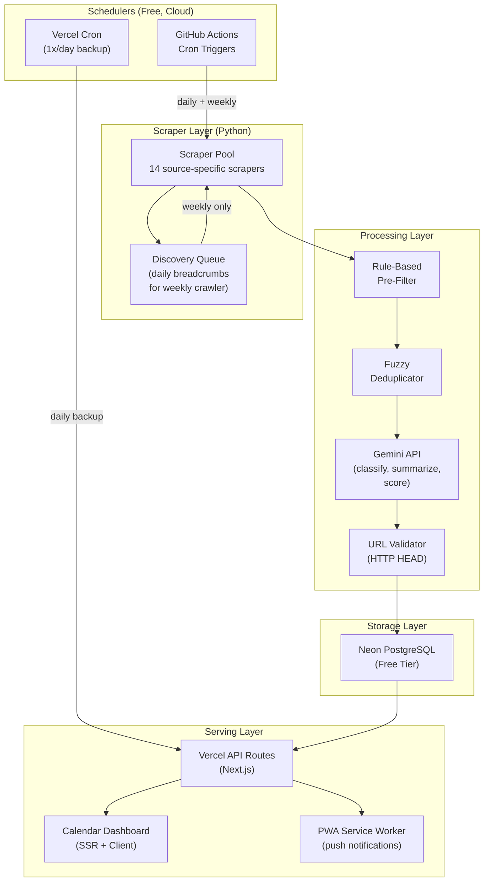

# StarBrief

Automated CS Opportunity Intelligence Pipeline.

The name is a nod to A* search: the algorithm that finds the optimal path. StarBrief finds the best opportunities and delivers a concise briefing. No noise, no manual sifting.

At its core, StarBrief scrapes 14 sources (Internshala, Unstop, DevPost, GitHub Issues, MLH, IIT portals, and more), runs the results through a multi-stage Python pipeline that filters, deduplicates, and structures them with LLMs, then displays the output on a custom-built web dashboard. Every piece runs on free-tier infrastructure, triggered by GitHub Actions cron jobs.

This is a personal tool first. It exists because the author got tired of missing good opportunities by discovering them a day after the deadline closed.

## Repository Structure

    StarBrief/
    ├── config/
    │   ├── default_profile.json    User interests, scoring weights, and notification preferences
    │   ├── exclusions.yaml         Keywords and patterns that disqualify a listing immediately
    │   └── sources.yaml            Per-source crawl config: URLs, methods, rate limits, filters
    │
    ├── dashboard/                  Next.js 16 web application (TypeScript, React 19, Framer Motion)
    │   ├── app/                    Page entry point, global CSS, layout
    │   ├── components/             Sidebar, OpportunityCard, TaskView, TimelineView, ViewToggle
    │   └── lib/                    TypeScript types and Sanzo Wada color tokens
    │
    ├── db/
    │   ├── connection.py           Async connection pool (asyncpg) and sync connection (psycopg2)
    │   └── models.py               Pydantic models mirroring the PostgreSQL schema
    │
    ├── docs/
    │   ├── design_research.md      Full UX design system: Sanzo Wada color palette, layout specs
    │   ├── implementation_plan.md  Complete architectural blueprint with schema, API, and pipeline specs
    │   └── analysis.html           Project analysis report (self-contained, opens in browser)
    │
    ├── pipeline/                   Cron orchestrators: daily sentinel and weekly deep crawler
    ├── processing/                 Pipeline stages: pre-filter, dedup, LLM structurer, scorer, validator
    ├── scrapers/                   Source-specific scraper implementations, all extending BaseScraper
    ├── tests/                      Pytest test suite with fixtures in conftest.py
    │
    ├── pyproject.toml              Project metadata, dependencies, Ruff and MyPy configuration
    └── requirements.txt            Pip-installable dependency list

## System Architecture

## How It Works

The pipeline runs on a dual cadence, which is the main architectural idea.

Every day, a lightweight sentinel re-checks all stored opportunity URLs for status changes and skims the front pages of each source to collect new URLs into a discovery queue. It does not do full scraping. It just leaves breadcrumbs.

Every week, a deeper crawler wakes up, processes the queued URLs with full scraping, goes several pages deep into each source, hits Reddit and university portals, and runs everything through the processing stages.

Processing stages, in order:

1. Rule-Based Pre-Filter. Before any API call, a keyword filter (configured in exclusions.yaml) discards irrelevant listings. Eliminates roughly 60% of raw items for free.

2. Fuzzy and Semantic Deduplication. The thefuzz library handles exact-ish duplicates by comparing title and organization strings. Google's text-embedding-004 model catches semantic duplicates that fuzzy matching misses (same opportunity posted to three platforms with different wording).

3. LLM Structuring. Groq (Llama 3 70B) receives each surviving listing and returns a structured JSON with category, summary, skills, deadlines, year requirements, and a base quality score. If Groq is unavailable or hallucinates, LiteLLM automatically reroutes to Gemini 1.5 Flash. A two-prompt reflection loop checks the extracted output for hallucinated dates or URLs.

4. Persona Scoring. A local scoring function in Python (no LLM needed) computes a relevance score between 0 and 1 for each opportunity against the default_profile.json. This determines the priority bucket: Critical, High, Medium, or Low.

5. URL Validation. HTTP HEAD requests verify that all apply URLs return a 200 before insertion.

6. Database Write. Verified records land in Neon PostgreSQL. The discovery queue row is marked processed. A scraper_runs log entry is updated with the run summary.

## Tech Stack

    Layer               Technology
    Scheduler           GitHub Actions cron (free for public repos)
    Backend language    Python 3.11+
    HTTP client         httpx (async)
    HTML parser         BeautifulSoup4 + lxml
    JS rendering        Playwright (JS-heavy sources only)
    Fuzzy match         thefuzz
    LLM routing         LiteLLM (Groq primary, Gemini Flash fallback)
    Database client     asyncpg (pipeline), psycopg2 (migrations)
    Database            Neon PostgreSQL serverless (free tier)
    Frontend framework  Next.js 16, React 19, TypeScript
    Frontend hosting    Vercel Hobby tier
    Data validation     Pydantic v2

## Getting Started

Backend setup:

    pip install -r requirements.txt
    cp .env.example .env
    # Fill in DATABASE_URL, GEMINI_API_KEY, GROQ_API_KEY, GITHUB_PAT
    python -m pytest

Dashboard setup:

    cd dashboard
    npm install
    npm run dev
    # Open http://localhost:3000

## Design System

The dashboard uses an Accessible Neo-Brutalist visual style built around the Sanzo Wada heritage color system. Wada curated 348 color combinations in 1933 for print harmony. Those same combinations, adapted for screens, give StarBrief a visual identity that is warm, readable, and nothing like the cold SaaS blues everywhere else.

Key tokens:

    Background (dark)   #0C0A09   Sumi-ink black (warm, not pure black)
    Background (light)  #FAF6F1   Washi paper off-white
    Brand accent        #BB7125   Raw Sienna
    Critical priority   #CC1236   Wada Carmine
    Monospace font      IBM Plex Mono

A subtle animated film grain overlay runs on the body at 8% opacity in light mode, 5% in dark, using a CSS SVG filter. It sounds unnecessary. It looks right.

The layout follows the Bookshelf Principle: all filters live in the sidebar, and switching between Task View and Timeline View changes only the rendering, not the data query. Nothing is duplicated.

## Current Status

Configuration, database layer, scraper base class, and dashboard UI are complete. The actual scraper implementations for the 6 Phase 1 sources, the pipeline orchestrators, and the API layer connecting the dashboard to PostgreSQL are the remaining work.

See docs/analysis.html for a full implementation status breakdown.
