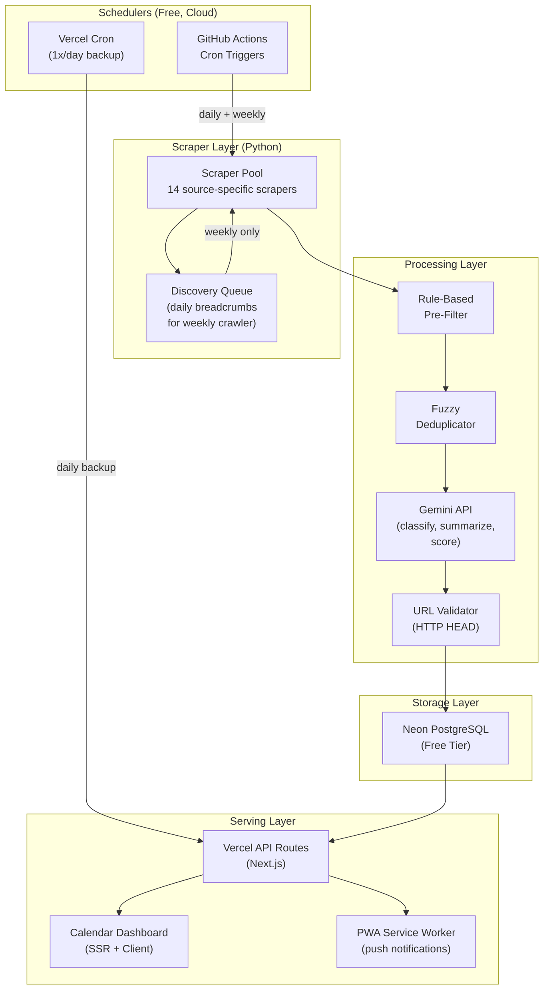
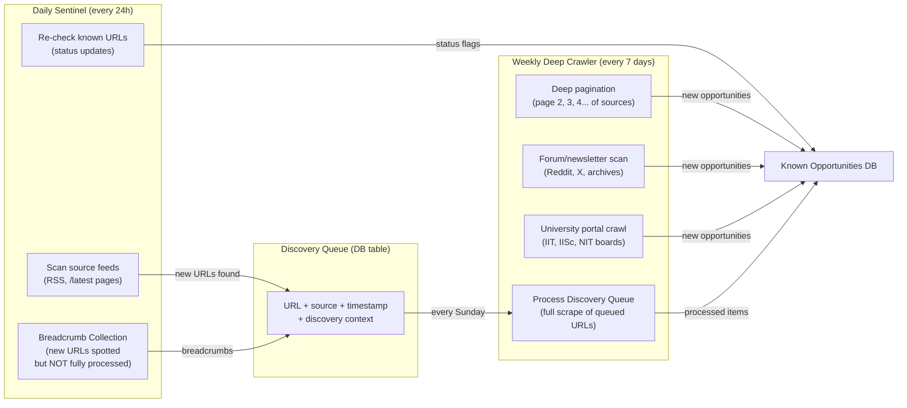
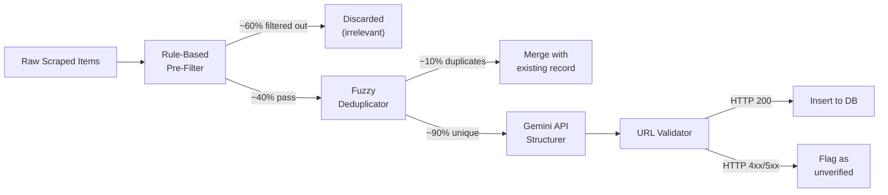

# StarBrief — Complete Architectural Blueprint

> **Project**: Automated CS Opportunity Intelligence Pipeline
> **Codename**: StarBrief (inspired by A* — the optimal path finder + brief = concise intelligence)
> **Author**: Anunay (design) + AntiGravity (architecture)
> **Status**: ✅ APPROVED — Ready for implementation
> **Design System**: See [design_research.md](file:///C:/Users/Anunay/.gemini/antigravity/brain/92b18d1a-d2f7-46c1-90f5-61bc2541fa2e/design_research.md) for full visual DNA

---

## Table of Contents

1. [Decision Log](#1-decision-log)
2. [System Architecture](#2-system-architecture)
3. [Infrastructure Stack](#3-infrastructure-stack)
4. [Dual-Cadence Crawl Engine](#4-dual-cadence-crawl-engine)
5. [Scraper Specifications](#5-scraper-specifications)
6. [Database Schema](#6-database-schema)
7. [Processing Pipeline](#7-processing-pipeline)
8. [API Design](#8-api-design)
9. [Calendar Dashboard UI](#9-calendar-dashboard-ui)
10. [Notification Strategy](#10-notification-strategy)
11. [User Personalization System](#11-user-personalization-system)
12. [Open Source Roadmap](#12-open-source-roadmap)
13. [Phased Rollout](#13-phased-rollout)
14. [Risk Matrix](#14-risk-matrix)
15. [Open Questions](#15-open-questions)

---

## 1. Decision Log

All decisions locked in from our discussion:

| Decision | Choice | Rationale |
|---|---|---|
| Hosting | Free cloud (GitHub Student Pack) | Spare laptop unreliable; cloud = 24/7 |
| Notification Channel | Web dashboard + PWA (Phase 1), Java Android app (Phase 3) | No Telegram; prefers browser-native UX |
| LLM Strategy | **Hybrid: Groq (Llama-3 70B) → Gemini 1.5 Flash fallback via LiteLLM** | Both free tier; Groq = speed (<1.5s), Gemini = reliability fallback |
| LLM Routing | **LiteLLM cascade router** | Single unified API, swap models via `.env`, no code changes |
| Agentic Strategies | **4 adopted** (see §7.1): Semantic Dedup, Reflection Loop, Persona Critic, Auto-Healing | Turns pipeline from dumb scraper into autonomous intelligence engine |
| Crawl Depth | Maximize coverage via incremental daily-to-weekly handoff | Daily collects breadcrumbs; weekly does deep dives |
| UI | Full interactive web dashboard with calendar/timeline | Modernly minimalistic, Macintosh-y |
| Name | **StarBrief** | A* search + brief = concise intelligence briefings |
| Process | Complete design first, then implement in one go | No phased build; design everything, then code |
| Open Source | After 1-2 months of personal use + testing | Private repo first, public after stabilization |
| Dashboard Hosting | **Vercel** (Hobby tier) | Best for Next.js, free cron, built-in edge |
| Dashboard Language | **TypeScript** | Type safety, better DX |
| Repo Structure | **Monorepo** | Simpler deployment, shared config |
| Initial Scrapers | **6 core** (Internshala, Unstop, DevPost, MLH, GitHub Issues, Konfhub) | Prove pipeline first, rest later |
| Design Reference | UntitledUI, Linear, Vercel Dashboard | Macintosh-y, minimal, comfortable |
| Free-tier sources | Groq (free), Gemini Flash (free), Google Embeddings (free) | 100% free-tier architecture |


---

## 2. System Architecture

### 2.1 High-Level Flow



### 2.2 Why This Architecture

| Component | Why This Over Alternatives |
|---|---|
| **GitHub Actions as scheduler** | Free for public repos (unlimited), free 2000 min/mo for private. No VPS needed. The scraper IS the CI job. |
| **Vercel for dashboard** | Free static + serverless hosting. Built-in cron (1x/day on free tier). Next.js SSR for SEO + fast calendar rendering. |
| **Neon PostgreSQL** | Free tier: 0.5 GB/branch, 10 GB total, 100 CU-hours/month. Scale-to-zero = no idle cost. Real SQL, not toy storage. |
| **Gemini API** | Free tier is generous (check AI Studio for current limits). Rule-based pre-filter ensures we only send ~50-100 items/week to the API, well within quota. |
| **PWA over native app (Phase 1)** | Zero additional codebase. Install-to-homescreen. Web push notifications on Android. Java app deferred to Phase 3 when the API is stable. |

---

## 3. Infrastructure Stack

### 3.1 Complete Technology Map

| Layer | Technology | Free Tier Limits | Our Expected Usage |
|---|---|---|---|
| **Scheduler** | GitHub Actions (cron) | Unlimited (public repo) | ~30 min/day = ~15 hrs/month |
| **Scheduler Backup** | Vercel Cron | 1x/day, 100 cron jobs | 1 job: daily status check |
| **Backend Language** | Python 3.11+ | N/A | Scrapers + processing scripts |
| **Frontend Framework** | Next.js 14+ (App Router) | N/A | Dashboard + API routes |
| **Frontend Hosting** | Vercel Hobby | 100GB bandwidth, 1M fn invocations | ~5GB bandwidth, ~10K invocations |
| **Database** | Neon PostgreSQL | 0.5 GB, 100 CU-hrs, scale-to-zero | ~50 MB data, ~20 CU-hrs |
| **LLM** | Gemini API (free tier) | Dynamic (check AI Studio) | ~50-100 calls/week |
| **ORM** | Drizzle ORM (TS) or raw SQL | N/A | Dashboard reads |
| **Python DB Client** | `psycopg2` or `asyncpg` | N/A | Scraper writes |
| **Fuzzy Match** | `thefuzz` (Python) | N/A | Dedup engine |
| **HTTP Client** | `httpx` (Python, async) | N/A | Scraping + validation |
| **JS Rendering** | Playwright (headless) | N/A | JS-heavy sites only |
| **Total Monthly Cost** | | | **$0** |

### 3.2 GitHub Student Pack Benefits Used

| Benefit | How We Use It |
|---|---|
| **GitHub Actions** | Scheduler + scraper runtime (primary) |
| **GitHub Pages** | Could host static docs/landing page |
| **DigitalOcean $200** | Emergency VPS if Actions insufficient (unlikely) |
| **Azure $100** | Backup cloud option |
| **MongoDB $50** | Not needed (using Neon PostgreSQL) |

---

## 4. Dual-Cadence Crawl Engine

### 4.1 The Incremental Coverage Strategy

This is the key innovation — your idea of the daily checker doing "pre-work" for the weekly crawler, formalized:



### 4.2 Daily Sentinel — Specification

**Trigger**: GitHub Actions cron, `0 2 * * *` (2:00 AM IST daily)
**Runtime Budget**: ~10-15 minutes
**Actions**:

| Step | What | How | Cost |
|---|---|---|---|
| 1. Status Check | Re-visit all ACTIVE opportunity URLs | `httpx` HEAD requests (async, 50 concurrent) | ~200-500 requests |
| 2. Change Detection | Compare page hash/content with stored version | Store MD5 hash of key page sections | Negligible |
| 3. Flag Updates | Mark opportunities as `UPDATED`, `EXPIRED`, or `CANCELLED` | Update DB records | ~5-20 DB writes |
| 4. Feed Scan | Hit `/latest` or RSS feeds of 14 sources | Quick GET + parse titles only | ~14 requests |
| 5. Breadcrumb Drop | Store newly spotted URLs in `discovery_queue` table | Insert URL + source + context | ~10-50 DB inserts |
| 6. Report | Log summary: "Checked 342 URLs, 5 expired, 12 breadcrumbs queued" | Structured JSON log | N/A |

### 4.3 Weekly Deep Crawler — Specification

**Trigger**: GitHub Actions cron, `0 3 * * 0` (3:00 AM IST every Sunday)
**Runtime Budget**: ~30-45 minutes
**Actions**:

| Step | What | How | Cost |
|---|---|---|---|
| 1. Queue Processing | Full-scrape every URL in `discovery_queue` | `httpx` + BeautifulSoup (+ Playwright for JS sites) | ~50-200 requests |
| 2. Deep Pagination | Go beyond page 1 on Internshala, Unstop, etc. | Paginate up to 5 pages deep per source | ~70 requests |
| 3. Forum Scan | Reddit API (r/Indian_Academia, r/developersIndia) | Reddit API (free, 100 req/min) | ~20 requests |
| 4. University Portals | Targeted URLs for IIT/IISc/NIT summer programs | `httpx` + BS4 | ~15 requests |
| 5. Newsletter Archives | TLDR, Morning Brew Tech (web archives) | `httpx` + BS4 | ~10 requests |
| 6. GitHub Issues | Search `good-first-issue` + `help-wanted` in AI/ML repos | GitHub REST API (5000 req/hr authenticated) | ~30 requests |
| 7. Dedup + Process | Run dedup engine, send new items to Gemini for classification | `thefuzz` + Gemini API | ~50-100 API calls |
| 8. Validate | HTTP HEAD check all new apply URLs | `httpx` async | ~50-100 requests |
| 9. Insert | Store all verified new opportunities in main DB | Bulk insert | ~50-100 DB writes |
| 10. Cleanup | Purge `discovery_queue` of processed items | Delete processed rows | ~50 DB deletes |

### 4.4 Coverage Maximization Algorithm

Your "don't miss anything" concern addressed via a **Source Coverage Score**:

```
For each Source S:
    coverage_score = (items_found_last_month / estimated_total_items) * reliability_factor

    If coverage_score < 0.5:
        Increase crawl depth (more pages, more frequent)
    If coverage_score > 0.9:
        Source is well-covered, maintain current cadence
    If source has 0 items for 2+ weeks:
        Flag for manual review (source may have changed structure)
```

This ensures underperforming scrapers get MORE attention, not less — the system self-corrects.

---

## 5. Scraper Specifications

### 5.1 Scraper Interface (Python)

Every scraper implements this contract:

```python
from dataclasses import dataclass
from datetime import datetime
from typing import Optional
from enum import Enum

class OpportunityCategory(Enum):
    INTERNSHIP = "internship"
    HACKATHON = "hackathon"
    WORKSHOP = "workshop"
    CONFERENCE = "conference"
    OPEN_SOURCE = "open_source"
    RESEARCH = "research"

@dataclass
class RawOpportunity:
    title: str
    organization: str
    category: OpportunityCategory
    source_url: str                       # MANDATORY: verified link
    apply_url: Optional[str]              # direct application link
    description: str                      # raw text, LLM will summarize
    deadline: Optional[datetime]
    event_date: Optional[datetime]
    location: Optional[str]
    is_remote: bool
    is_paid: Optional[bool]
    stipend_info: Optional[str]
    skills_mentioned: list[str]           # extracted from listing text
    year_requirement: Optional[str]       # "2nd year", "pre-final", etc.
    is_female_exclusive: bool
    raw_html: Optional[str]              # for change detection (hash)

class BaseScraper:
    """All scrapers inherit from this."""
    name: str
    base_url: str
    supports_daily_check: bool
    supports_deep_crawl: bool

    async def daily_check(self, known_urls: list[str]) -> dict:
        """Return status updates for known URLs + breadcrumbs."""
        raise NotImplementedError

    async def deep_crawl(self, discovery_queue: list[str]) -> list[RawOpportunity]:
        """Full scrape: process queue + paginate for new items."""
        raise NotImplementedError
```

### 5.2 Source-by-Source Specifications

#### S01: Internshala
| Field | Value |
|---|---|
| URL | `https://internshala.com/internships/computer-science-internship/` |
| Method | `httpx` + BeautifulSoup (server-rendered HTML) |
| Daily | Check first page for new listings + re-check known URLs |
| Weekly | Paginate 5 pages deep. Filter: CS, AI/ML, Data Science, Remote |
| Auth | None required |
| Gotchas | Aggressive rate limiting. Use 2-3 second delays between requests. Rotate User-Agent. |
| Extract | Title, company, location, stipend, duration, skills, apply link |

#### S02: Unstop (formerly D2C)
| Field | Value |
|---|---|
| URL | `https://unstop.com/hackathons`, `/competitions`, `/internships` |
| Method | API endpoint exists (`/api/public/opportunity/search-new`) — prefer API over scraping |
| Daily | API call with date filter for updated listings |
| Weekly | Full search with pagination: hackathons, coding challenges, case studies |
| Auth | None for public API |
| Gotchas | API may change without notice. Keep a fallback HTML scraper. |
| Extract | Title, org, type, deadline, team size, prize, eligibility, apply link |

#### S03: DevPost
| Field | Value |
|---|---|
| URL | `https://devpost.com/hackathons?status[]=upcoming&status[]=open` |
| Method | `httpx` + BS4 (well-structured HTML) |
| Daily | Check first page of "upcoming" and "open" |
| Weekly | Paginate. Filter by themes: AI, ML, Data, Health, Social Good |
| Auth | None |
| Gotchas | Clean HTML, easy to parse. Global focus — lots of results. |
| Extract | Title, host, themes, deadline, prizes, submission reqs, team size |

#### S04: MLH (Major League Hacking)
| Field | Value |
|---|---|
| URL | `https://mlh.io/seasons/2026/events` |
| Method | `httpx` + BS4 |
| Daily | Check event page for status changes |
| Weekly | Full season page scan |
| Auth | None |
| Gotchas | Season-based. Events well-structured. |
| Extract | Event name, date, location, digital/in-person, registration link |

#### S05: GitHub Issues (Good First Issues)
| Field | Value |
|---|---|
| URL | `https://api.github.com/search/issues` |
| Method | GitHub REST API (authenticated = 5000 req/hr) |
| Daily | Query: `label:"good first issue" language:python created:>YESTERDAY` |
| Weekly | Broader: AI/ML repos, multiple languages, `help-wanted` label |
| Auth | GitHub PAT (free, from your account) |
| Gotchas | Search API has 30 results/page, 1000 total. Use specific queries. |
| Extract | Repo name, issue title, labels, language, stars, URL, body snippet |
| Repos to Watch | `langchain`, `huggingface/transformers`, `pytorch`, `scikit-learn`, `fastapi`, `keras`, smaller research repos |

#### S06: Konfhub
| Field | Value |
|---|---|
| URL | `https://konfhub.com/events` |
| Method | `httpx` + BS4 |
| Daily | No (weekly only — events don't change daily) |
| Weekly | Scan tech events, filter: AI, ML, Cloud, Data |
| Auth | None |
| Extract | Event name, date, venue, fee, speakers, registration link |

#### S07: Townscript
| Field | Value |
|---|---|
| URL | `https://www.townscript.com/in/online/technology` |
| Method | `httpx` + BS4 |
| Daily | No |
| Weekly | India-focused tech events and workshops |
| Auth | None |
| Extract | Event name, date, city, fee, registration link |

#### S08: Luma
| Field | Value |
|---|---|
| URL | `https://lu.ma/discover` |
| Method | Likely needs Playwright (JS-rendered) |
| Daily | No |
| Weekly | Tech meetups, AI/ML events |
| Auth | None |
| Gotchas | Heavy JS rendering. Playwright required. |
| Extract | Event name, host, date, location, RSVP link |

#### S09: IIT/IISc Research Programs
| Field | Value |
|---|---|
| URLs | IISc SPARK, IIT Bombay SRF, IIT Madras Summer Fellowship, IIT Kanpur SURGE, IIT Delhi SURA, IIIT Hyderabad |
| Method | `httpx` + BS4 (static university pages) |
| Daily | No |
| Weekly | Check application status pages for each program |
| Auth | None |
| Gotchas | URLs change yearly. Need manual URL update each season (Jan-Feb). |
| Extract | Program name, institute, dates, eligibility, stipend, apply link |

#### S10: Reddit
| Field | Value |
|---|---|
| Subreddits | `r/Indian_Academia`, `r/developersIndia`, `r/cscareerquestions`, `r/MachineLearning` |
| Method | Reddit API (OAuth, free tier) |
| Daily | No |
| Weekly | Search recent posts with keywords: "internship", "hiring", "hackathon", "workshop" |
| Auth | Reddit app credentials (free) |
| Gotchas | Noisy. Many irrelevant posts. Rule-based pre-filter essential. |
| Extract | Post title, URL, body snippet, upvotes (quality signal), comment count |

#### S11: LinkedIn Jobs (via SerpAPI proxy)
| Field | Value |
|---|---|
| Method | SerpAPI Google Jobs engine OR direct `httpx` scrape of public listings |
| Daily | No (rate-limited) |
| Weekly | Search: "AI ML internship India", "Data Science intern Bangalore", etc. |
| Auth | SerpAPI key (free: 100 searches/month) |
| Gotchas | 100 free searches is tight. Use very targeted queries. |
| Extract | Job title, company, location, apply link, description snippet |

#### S12: Google Jobs (via SerpAPI)
| Field | Value |
|---|---|
| Method | SerpAPI `google_jobs` engine |
| Daily | No |
| Weekly | Targeted queries for internships |
| Auth | Same SerpAPI key as S11 (shared 100/month budget) |
| Extract | Title, company, location, via (source), apply link |

> [!NOTE]
> S11 and S12 share a 100 searches/month budget. Allocate ~60 to Google Jobs (broader) and ~40 to LinkedIn.

#### S13: Twitter/X (Tech Hiring Accounts)
| Field | Value |
|---|---|
| Method | `httpx` scrape of nitter instances (public, no auth) OR X API free tier |
| Daily | No |
| Weekly | Monitor specific accounts: `@tecaborejobs`, `@RemoteIndian`, and hashtags `#hiring #internship #AIjobs` |
| Auth | Optional (nitter = no auth, X API free tier = limited) |
| Gotchas | X API free tier is very limited (1500 reads/month). Nitter instances are unreliable. |
| Extract | Tweet text, URLs, account name, timestamp |

#### S14: Conference Aggregators
| Field | Value |
|---|---|
| URLs | `confs.tech`, `developers.events`, `techevents.online` |
| Method | `httpx` + BS4 |
| Daily | No |
| Weekly | CS/AI/ML conferences, global scope |
| Auth | None |
| Extract | Conference name, dates, location, CFP deadline, registration link |

---

## 6. Database Schema

### 6.1 Core Tables

```sql
-- Main opportunity table
CREATE TABLE opportunities (
    id              UUID PRIMARY KEY DEFAULT gen_random_uuid(),
    title           TEXT NOT NULL,
    organization    TEXT NOT NULL,
    category        TEXT NOT NULL CHECK (category IN (
                        'internship', 'hackathon', 'workshop',
                        'conference', 'open_source', 'research'
                    )),

    -- Temporal
    discovered_at   TIMESTAMPTZ NOT NULL DEFAULT NOW(),
    deadline        TIMESTAMPTZ,                -- NULL = rolling/unknown
    event_date      TIMESTAMPTZ,                -- NULL for internships
    expires_at      TIMESTAMPTZ,                -- auto-calculated or manual

    -- Location
    location        TEXT,                        -- city name or "Remote"
    geo_scope       TEXT CHECK (geo_scope IN ('local', 'pan_india', 'global')),
    is_remote       BOOLEAN DEFAULT FALSE,

    -- Requirements
    min_year        INTEGER,                     -- minimum year of study
    max_year        INTEGER,                     -- maximum year of study
    skills_required TEXT[],                       -- PostgreSQL array
    is_paid         BOOLEAN,
    stipend_range   TEXT,                         -- "15k-25k/month"
    is_female_exclusive BOOLEAN DEFAULT FALSE,

    -- Links (MANDATORY)
    source_url      TEXT NOT NULL,                -- where we found it
    apply_url       TEXT,                          -- direct application
    source_name     TEXT NOT NULL,                 -- "Internshala", "Unstop", etc.

    -- Content
    raw_description TEXT,                          -- original text
    summary         TEXT,                          -- LLM-generated 2-3 lines
    content_hash    TEXT,                           -- MD5 of key content (change detection)

    -- Scoring (computed per user profile)
    base_relevance  FLOAT DEFAULT 0.0,             -- profile-independent quality score

    -- Status
    status          TEXT NOT NULL DEFAULT 'active'
                    CHECK (status IN (
                        'active', 'deadline_approaching', 'expired',
                        'cancelled', 'updated', 'unverified'
                    )),
    last_checked_at TIMESTAMPTZ DEFAULT NOW(),
    url_valid       BOOLEAN DEFAULT TRUE,

    -- Constraints
    UNIQUE(source_url)                              -- no duplicate URLs
);

-- Change log for tracking updates
CREATE TABLE opportunity_changes (
    id              UUID PRIMARY KEY DEFAULT gen_random_uuid(),
    opportunity_id  UUID REFERENCES opportunities(id) ON DELETE CASCADE,
    changed_at      TIMESTAMPTZ DEFAULT NOW(),
    field_name      TEXT NOT NULL,
    old_value       TEXT,
    new_value       TEXT
);

-- Discovery queue (daily breadcrumbs for weekly crawler)
CREATE TABLE discovery_queue (
    id              UUID PRIMARY KEY DEFAULT gen_random_uuid(),
    url             TEXT NOT NULL UNIQUE,
    source_name     TEXT NOT NULL,
    discovered_at   TIMESTAMPTZ DEFAULT NOW(),
    context         TEXT,                          -- why we think this is relevant
    processed       BOOLEAN DEFAULT FALSE,
    processed_at    TIMESTAMPTZ
);

-- Scraper health tracking
CREATE TABLE scraper_runs (
    id              UUID PRIMARY KEY DEFAULT gen_random_uuid(),
    scraper_name    TEXT NOT NULL,
    run_type        TEXT CHECK (run_type IN ('daily', 'weekly')),
    started_at      TIMESTAMPTZ DEFAULT NOW(),
    completed_at    TIMESTAMPTZ,
    items_found     INTEGER DEFAULT 0,
    items_new       INTEGER DEFAULT 0,
    items_updated   INTEGER DEFAULT 0,
    items_expired   INTEGER DEFAULT 0,
    errors          TEXT[],
    status          TEXT CHECK (status IN ('running', 'success', 'failed'))
);

-- User profiles (multi-user ready for Phase 3)
CREATE TABLE user_profiles (
    id              UUID PRIMARY KEY DEFAULT gen_random_uuid(),
    name            TEXT NOT NULL,
    email           TEXT UNIQUE,
    year_of_study   INTEGER,
    graduation_year INTEGER,
    degree          TEXT,
    interests       JSONB NOT NULL DEFAULT '{}',
    filters         JSONB NOT NULL DEFAULT '{}',
    notification_prefs JSONB NOT NULL DEFAULT '{}',
    scoring_weights JSONB NOT NULL DEFAULT '{}',
    created_at      TIMESTAMPTZ DEFAULT NOW(),
    updated_at      TIMESTAMPTZ DEFAULT NOW()
);

-- User-specific opportunity scores (materialized per profile)
CREATE TABLE user_opportunity_scores (
    user_id         UUID REFERENCES user_profiles(id) ON DELETE CASCADE,
    opportunity_id  UUID REFERENCES opportunities(id) ON DELETE CASCADE,
    relevance_score FLOAT NOT NULL,              -- 0.0 to 1.0
    priority        TEXT CHECK (priority IN ('critical', 'high', 'medium', 'low')),
    is_dismissed    BOOLEAN DEFAULT FALSE,        -- user said "not interested"
    is_saved        BOOLEAN DEFAULT FALSE,        -- user bookmarked
    computed_at     TIMESTAMPTZ DEFAULT NOW(),
    PRIMARY KEY (user_id, opportunity_id)
);

-- Indexes for performance
CREATE INDEX idx_opps_status ON opportunities(status);
CREATE INDEX idx_opps_category ON opportunities(category);
CREATE INDEX idx_opps_deadline ON opportunities(deadline);
CREATE INDEX idx_opps_discovered ON opportunities(discovered_at);
CREATE INDEX idx_opps_source ON opportunities(source_name);
CREATE INDEX idx_scores_user ON user_opportunity_scores(user_id);
CREATE INDEX idx_scores_priority ON user_opportunity_scores(priority);
CREATE INDEX idx_queue_processed ON discovery_queue(processed);
```

### 6.2 Storage Estimate

| Table | Rows (steady state) | Size Estimate |
|---|---|---|
| `opportunities` | ~500-1000 active | ~5 MB |
| `opportunity_changes` | ~2000 records/month | ~1 MB |
| `discovery_queue` | ~50-200 (flushed weekly) | <1 MB |
| `scraper_runs` | ~60 records/month | <1 MB |
| `user_profiles` | 1 (Phase 1), ~100 (Phase 3) | <1 MB |
| `user_opportunity_scores` | ~1000 per user | ~1 MB |
| **Total** | | **~10 MB** (well within Neon 500 MB) |

---

## 7. Processing Pipeline

### 7.1 Pipeline Stages



### 7.1 Agentic Intelligence Strategies

Four autonomous strategies elevate the pipeline beyond a dumb scraper:

#### Strategy A — Semantic Deduplication (Vector Memory)
Standard fuzzy string matching misses semantically identical jobs on multiple platforms. We use Google's free `text-embedding-004` model to generate a vector for each opportunity's title+description. Before inserting, cosine similarity is computed against opportunities from the last 14 days. If similarity ≥ 0.92 → append new source URL to existing record. Cost: zero. Deps: `google-generativeai`, `numpy`.

#### Strategy B — Reflection Loop (Hallucination Catcher)
Two-prompt Actor-Critic pattern. **Actor (Groq):** Extracts JSON. **Critic (Groq):** "Did the Actor hallucinate any dates or URLs not in the source text? YES/NO." If YES → re-route to Gemini Flash for careful re-extraction. Expected: ~15% fewer hallucinated deadlines. Cost: two Groq calls (<3s total, still free).

#### Strategy C — Persona Critic (Deep Personalization)
The LLM receives `default_profile.json` alongside the raw opportunity and produces a `relevance_score (0.0–1.0)` and one-sentence `relevance_justification`. Score stored in `user_opportunity_scores` and displayed as a contextual badge in the dashboard: *"⭐ 94% — Matches your Transformers interest, remote."*

#### Strategy D — Auto-Healing Scraper
If a scraper returns 0 results when it previously returned 50+, the anomaly detector passes the raw HTML to Gemini 1.5 Flash (1M context window) asking it to identify new CSS selectors. Selectors update in-memory for the current run. Cost: one Gemini call only on failure, zero during normal operation.

### 7.2 LLM Router (Groq → Gemini Cascade via LiteLLM)

```python
# processing/llm_router.py
PRIMARY_MODEL  = "groq/llama3-70b-8192"    # free, ~800 tok/s
FALLBACK_MODEL = "gemini/gemini-1.5-flash"  # free, reliable
# Try Groq first; on any exception, fall back to Gemini automatically.
```

Env keys needed: `GROQ_API_KEY`, `GEMINI_API_KEY`.

### 7.3 Rule-Based Pre-Filter (No LLM)


Before spending Gemini API calls, a fast rule-based filter eliminates irrelevant items:

```python
INCLUDE_KEYWORDS = [
    "AI", "ML", "machine learning", "deep learning", "NLP",
    "data science", "neural network", "computer vision", "LLM",
    "intern", "hackathon", "workshop", "research", "fellowship",
    "python", "pytorch", "tensorflow", "transformers", "GenAI",
    "open source", "good first issue", "contribute"
]

EXCLUDE_KEYWORDS = [
    "SSZONE Technologies",   # critical exclusion
    "sales", "marketing", "HR",
    "content writing", "social media manager",
    "MBA", "commerce", "finance internship"
]

EXCLUDE_PATTERNS = [
    r"(?i)sszone",           # any variation of the excluded company
]

def passes_prefilter(item: RawOpportunity) -> bool:
    text = f"{item.title} {item.organization} {item.description}".lower()

    # Hard exclusions
    for pattern in EXCLUDE_PATTERNS:
        if re.search(pattern, text):
            return False

    for keyword in EXCLUDE_KEYWORDS:
        if keyword.lower() in text:
            return False

    # Must match at least one include keyword
    for keyword in INCLUDE_KEYWORDS:
        if keyword.lower() in text:
            return True

    return False  # no match = skip
```

**Expected filtering**: ~60% of raw items eliminated before any API call.

### 7.3 Fuzzy Deduplication

```python
from thefuzz import fuzz

def is_duplicate(new_item: RawOpportunity, existing: list[dict]) -> Optional[UUID]:
    """Check if new_item is a duplicate of any existing opportunity."""
    for existing_item in existing:
        # Compare title + org combo
        title_sim = fuzz.token_sort_ratio(new_item.title, existing_item["title"])
        org_sim = fuzz.token_sort_ratio(new_item.organization, existing_item["organization"])

        # If both title and org are >85% similar, it's a duplicate
        if title_sim > 85 and org_sim > 85:
            return existing_item["id"]  # return existing ID for merging

    return None  # not a duplicate
```

### 7.4 Gemini API Structurer

**Purpose**: For items that pass pre-filter and dedup, Gemini does:

1. **Classify** the opportunity (category, geo_scope)
2. **Summarize** the description into 2-3 crisp lines
3. **Extract** structured metadata (skills, year requirement, stipend)
4. **Score** base quality (independent of user profile)

**Prompt Template** (sent to Gemini):

```
You are a data extraction engine. Given this opportunity listing, return ONLY valid JSON:

INPUT:
Title: {title}
Organization: {org}
Description: {description}
Source: {source_name}

OUTPUT FORMAT:
{
    "category": "internship|hackathon|workshop|conference|open_source|research",
    "summary": "2-3 line crisp summary",
    "skills_required": ["Python", "TensorFlow", ...],
    "min_year": 1-4 or null,
    "max_year": 1-4 or null,
    "is_paid": true/false/null,
    "stipend_range": "string or null",
    "geo_scope": "local|pan_india|global",
    "is_female_exclusive": true/false,
    "base_quality_score": 0.0-1.0
}
```

**API Budget**: ~50-100 calls per weekly run. Well within free tier.

### 7.5 Relevance Scoring (Per User Profile)

After Gemini structures the data, a local scoring function computes per-user relevance:

```python
def compute_relevance(opportunity: dict, profile: dict) -> tuple[float, str]:
    """Returns (score: 0.0-1.0, priority: critical|high|medium|low)"""
    weights = profile["scoring_weights"]
    score = 0.0

    # Field match (how well does this match user's interests?)
    field_overlap = len(
        set(opportunity["skills_required"]) &
        set(profile["interests"]["primary"])
    ) / max(len(profile["interests"]["primary"]), 1)
    score += weights["field_match"] * field_overlap

    # Deadline urgency (closer = higher)
    if opportunity["deadline"]:
        days_left = (opportunity["deadline"] - datetime.now()).days
        if days_left <= 3:
            urgency = 1.0
        elif days_left <= 7:
            urgency = 0.8
        elif days_left <= 14:
            urgency = 0.5
        else:
            urgency = 0.2
        score += weights["deadline_urgency"] * urgency

    # Organization prestige (simple tier list)
    prestige = get_org_prestige(opportunity["organization"])  # 0.0-1.0
    score += weights["organization_prestige"] * prestige

    # Compensation
    if opportunity["is_paid"]:
        score += weights["compensation"] * 1.0
    elif opportunity["is_paid"] is None:
        score += weights["compensation"] * 0.5

    # Determine priority bucket
    if score >= 0.75:
        priority = "critical"
    elif score >= 0.5:
        priority = "high"
    elif score >= 0.25:
        priority = "medium"
    else:
        priority = "low"

    return (round(score, 3), priority)
```

---

## 8. API Design

### 8.1 API Routes (Next.js App Router)

The dashboard needs these API endpoints:

```
GET  /api/opportunities
     ?status=active
     &category=internship,hackathon
     &priority=critical,high
     &timeframe=this_week|next_week|this_month|rolling
     &search=machine+learning
     &page=1&limit=20

GET  /api/opportunities/[id]
     Full details for a single opportunity

GET  /api/opportunities/timeline
     Grouped by time bucket: today, this_week, next_week, this_month, rolling

GET  /api/stats
     Dashboard stats: total active, by category, by priority, last crawl time

POST /api/opportunities/[id]/dismiss
     Mark as "not interested" for current user

POST /api/opportunities/[id]/save
     Bookmark for current user

GET  /api/scraper/status
     Health check: last run times, items found, errors per scraper

POST /api/profile
     Update user profile (interests, filters, weights)

GET  /api/profile
     Get current user profile

POST /api/trigger/daily    (protected, called by GitHub Actions webhook)
     Trigger a data refresh from latest scraper results

POST /api/trigger/recompute-scores  (protected)
     Recompute all relevance scores after profile change
```

### 8.2 Data Flow: GitHub Actions -> Neon -> Vercel

```
GitHub Actions (scraper runs) 
    --> Writes directly to Neon PostgreSQL (via connection string)
    --> Optionally hits POST /api/trigger/daily (Vercel webhook)
    --> Vercel API reads from Neon
    --> Dashboard renders latest data
```

No file syncing, no intermediary storage. GitHub Actions writes to the same DB that Vercel reads from.

---

## 9. Dashboard UI & Design System

> **Color Source**: Sanzo Wada — *A Dictionary of Color Combinations* (1933)
> **Layout**: Dual-view (Task + Timeline), unified sidebar filters
> **Principle**: Bookshelf, not side-table — data lives where it belongs

### 9.1 Design Philosophy

| Quality | How It's Achieved |
|---|---|
| **Precision** | Strict 8px spacing grid, optical alignment |
| **Breathing Room** | Generous whitespace (48px section gaps) |
| **Quiet Depth** | Subtle shadows, 1px borders at 6-8% opacity |
| **Warmth** | Sanzo Wada heritage palette — warm, not cold |
| **Instant Feel** | 100-150ms transitions, no sluggish animations |

### 9.2 Sanzo Wada Color Tokens

```css
:root {
    /* ═══════════════════════════════════════════════ */
    /* StarBrief Tokens — Sanzo Wada Heritage          */
    /* ═══════════════════════════════════════════════ */

    /* ─── Surfaces (Wada: darkened neutrals) ─── */
    --bg-base:      #0C0A09;   /* sumi-ink black (warm, not cold) */
    --bg-surface:   #1A1614;   /* charred wood */
    --bg-raised:    #242019;   /* weathered timber */
    --bg-hover:     #2E2A22;   /* warm stone */
    --bg-active:    #38332A;   /* aged paper reverse */

    /* ─── Borders (whisper-thin, warm) ─── */
    --border-subtle:  rgba(199, 178, 153, 0.08);
    --border-default: rgba(199, 178, 153, 0.14);
    --border-strong:  rgba(199, 178, 153, 0.22);

    /* ─── Text (Wada: warm neutrals) ─── */
    --text-primary:   #E8E0D4;  /* unbleached silk */
    --text-secondary: #B5A898;  /* aged linen */
    --text-muted:     #8A7E6E;  /* driftwood */
    --text-faint:     #5E554A;  /* shadow clay */

    /* ─── Light Mode ─── */
    --bg-base-light:      #FAF6F1;  /* washi paper */
    --bg-surface-light:   #FFFFFF;
    --bg-raised-light:    #F3EDE5;  /* toasted cream */
    --text-primary-light: #1A1614;
    --text-muted-light:   #8A7E6E;
    --border-subtle-light: rgba(26, 22, 20, 0.08);

    /* ─── Brand Accent (Wada: Raw Sienna #bb7125) ─── */
    --accent:        #BB7125;  /* Raw Sienna — the "star" */
    --accent-hover:  #D4872E;
    --accent-muted:  rgba(187, 113, 37, 0.15);

    /* ─── Priority (Wada-sourced) ─── */
    --priority-critical:     #CC1236;  /* Wada "Carmine" */
    --priority-critical-bg:  rgba(204, 18, 54, 0.12);
    --priority-high:         #BB7125;  /* Wada "Raw Sienna" */
    --priority-high-bg:      rgba(187, 113, 37, 0.12);
    --priority-medium:       #4B7D8D;  /* Wada "Gobelin Blue" */
    --priority-medium-bg:    rgba(75, 125, 141, 0.12);
    --priority-low:          #8A7E6E;  /* Wada "Driftwood" */
    --priority-low-bg:       rgba(138, 126, 110, 0.10);

    /* ─── Category (Wada-sourced tints) ─── */
    --cat-internship:   #4B7D8D;  /* Gobelin Blue */
    --cat-hackathon:    #DA525D;  /* Eugenia Red B */
    --cat-workshop:     #D4872E;  /* Bright Sienna */
    --cat-opensource:    #5B7745;  /* Cypress Green */
    --cat-research:     #8B6BAE;  /* Wisteria */
    --cat-conference:   #C7A84E;  /* Golden Ochre */

    /* ─── Typography ─── */
    --font-sans:  'Inter', -apple-system, BlinkMacSystemFont, sans-serif;
    --font-mono:  'JetBrains Mono', 'SF Mono', monospace;

    --text-xs: 12px;  --text-sm: 13px;  --text-base: 15px;
    --text-lg: 18px;  --text-xl: 22px;  --text-2xl: 28px;

    --weight-normal: 400;  --weight-medium: 500;
    --weight-semibold: 600;  --weight-bold: 700;

    --leading-tight: 1.3;  --leading-normal: 1.5;  --leading-relaxed: 1.65;

    /* ─── Spacing (8px grid) ─── */
    --space-1: 4px;   --space-2: 8px;   --space-3: 12px;
    --space-4: 16px;  --space-5: 20px;  --space-6: 24px;
    --space-8: 32px;  --space-10: 40px; --space-12: 48px;

    /* ─── Layout ─── */
    --sidebar-width: 260px;  --content-max: 960px;  --card-padding: 20px;

    /* ─── Borders & Shadows ─── */
    --radius-sm: 6px;  --radius-md: 10px;  --radius-lg: 14px;  --radius-full: 9999px;
    --shadow-xs: 0 1px 2px rgba(12, 10, 9, 0.15);
    --shadow-sm: 0 1px 3px rgba(12, 10, 9, 0.20);
    --shadow-md: 0 4px 12px rgba(12, 10, 9, 0.25);

    /* ─── Transitions ─── */
    --transition-fast: 100ms ease-out;
    --transition-normal: 150ms ease-out;
    --transition-slow: 200ms ease-out;
}
```

### 9.3 Dual-View System

Two views of the same data. Same sidebar, same filters, different rendering.

#### View Toggle (Top Bar)

```
┌──────────────────────────────────────────────────────────────┐
│ ★ StarBrief    [🔍 Search... ⌘K]       [☰ Tasks] [═ Timeline] │
└──────────────────────────────────────────────────────────────┘
```

#### Task View (Default) — "What should I act on NOW?"

Vertical card list, grouped by time bucket, sorted by priority then deadline.

```
┌─── SIDEBAR ────┐ ┌──────────── CONTENT ─────────────────────┐
│                 │ │                                           │
│ CATEGORIES      │ │  TODAY (Apr 14) ─────────────── 2 items   │
│ ● All      (34) │ │                                           │
│ ○ Intern   (12) │ │  ┌─▌────────────────────────────────────┐  │
│ ○ Hack      (8) │ │  │▌ ● CRITICAL  GSoC 2026              │  │
│ ○ Work      (3) │ │  │▌ 2 days left · OSS · Remote [Apply→]│  │
│ ○ OSS       (5) │ │  └─▌────────────────────────────────────┘  │
│ ○ Research  (2) │ │                                           │
│ ○ Conf      (4) │ │  ┌─▌────────────────────────────────────┐  │
│                 │ │  │▌ ● HIGH  IISc SPARK Research         │  │
│ ─ ─ ─ ─ ─ ─ ─ │ │  │▌ Apr 16 · Research · Bangalore       │  │
│                 │ │  └─▌────────────────────────────────────┘  │
│ PRIORITY        │ │                                           │
│ ◉ Critical  (3) │ │  THIS WEEK (Apr 14-20) ──────── 5 items  │
│ ◉ High      (9) │ │  ...                                      │
│ ◉ Medium   (15) │ │                                           │
│ ○ Low      (22) │ │  ROLLING (No Deadline) ──────── 12 items  │
│                 │ │  ...                                      │
│ ─ ─ ─ ─ ─ ─ ─ │ └───────────────────────────────────────────┘
│                 │
│ LOCATION        │
│ ◉ Remote        │
│ ◉ Pan-India     │
│ ◉ Global        │
│                 │
│ ─ ─ ─ ─ ─ ─ ─ │
│ ✓ 14/14 scrapers│
│ Last: 2:15 AM   │
└─────────────────┘
```

#### Timeline View — "When does everything happen?"

Google Calendar-style horizontal Gantt bars showing opportunity date ranges.

```
┌─── SIDEBAR ────┐ ┌──────────── TIMELINE ──────────────────────┐
│                 │ │                                             │
│ (same filters)  │ │  ◄ Apr 2026 ►                               │
│                 │ │                                             │
│                 │ │  Mon 14  Tue 15  Wed 16  Thu 17  Fri 18    │
│                 │ │  ──────────────────────────────────────     │
│                 │ │                                             │
│                 │ │  ████████████████  GSoC (CRITICAL)          │
│                 │ │                                             │
│                 │ │      ██████████████  IISc SPARK (HIGH)      │
│                 │ │                                             │
│                 │ │          ████████████████  Unstop ML (HIGH) │
│                 │ │                                             │
│                 │ │  ████  MLH Hack (MEDIUM)                    │
│                 │ │                                             │
│                 │ │  ─── No Deadline ─────────────────────────  │
│                 │ │  ████████████████████  GitHub Issues (LOW)  │
│                 │ │                                             │
└─────────────────┘ └─────────────────────────────────────────────┘
```

**Timeline rules**:
- Horizontal axis = dates (scrollable, week at a time)
- Bar = opportunity, spans from `event_date`/`discovered_at` to `deadline`
- Bar color: left cap = priority color, body = muted category tint
- Hover: tooltip with title + deadline + apply link
- Click: expands to full detail panel
- Today marker: vertical dashed line in `--accent`
- Rolling items: pinned "No deadline" row at bottom

### 9.4 Expanded Card (Click to Expand)

```
┌─▌───────────────────────────────────────────────────────┐
│▌  ● CRITICAL   Google Summer of Code 2026         [✕]   │
├─▌───────────────────────────────────────────────────────┤
│▌                                                        │
│▌  Organization   Google / Open Source                    │
│▌  Category       Open Source Program                     │
│▌  Deadline       April 16, 2026 (2 DAYS LEFT)           │
│▌  Location       Remote (Global)                         │
│▌                                                        │
│▌  Summary                                                │
│▌  Annual open source program. Contribute to a mentored   │
│▌  project over summer. Stipend provided by Google.       │
│▌                                                        │
│▌  Skills    Python  Git  C++                             │
│▌  Stipend   $1,500 – $6,600                              │
│▌                                                        │
│▌  Source: summerofcode.withgoogle.com                    │
│▌  Verified: Apr 14, 2:15 AM                              │
│▌                                                        │
│▌  [Apply Now →]        [Dismiss]        [★ Save]         │
└─▌───────────────────────────────────────────────────────┘
```

### 9.5 Unified Sidebar (The Filter IS the Sidebar)

All filters merged into one panel. No separate filter overlay, no tab bar.

**Sections** (top to bottom):
1. **Logo** — StarBrief wordmark
2. **Categories** — Radio/checkbox with counts
3. **Priority** — Checkboxes (Critical/High/Medium checked by default)
4. **Location** — Checkboxes (Remote/Pan-India/Global)
5. **Divider**
6. **Pipeline Health** — Compact status (scraper count, last/next crawl)

Changing any filter re-renders both views instantly (client-side, no re-fetch).

### 9.6 Responsive Behavior

| Breakpoint | Layout |
|---|---|
| `≥1200px` | Sidebar (260px) + Content (fluid) |
| `768-1199px` | Sidebar collapses to icon-rail (56px) + Content |
| `<768px` (PWA) | No sidebar → bottom tabs (Tasks / Timeline / Filters / Settings) |

### 9.7 View Switching Rules

| Aspect | Task View | Timeline View |
|---|---|---|
| Best for | "What to apply for now?" | "What's the landscape?" |
| Grouping | By time bucket | By date axis |
| Sort | Priority ↓ then deadline ↑ | Deadline ↑ (chronological) |
| Default (desktop) | ✓ | |
| Default (mobile) | ✓ | |
| Sidebar filters | Persist across view switch |

---

## 10. Notification Strategy

### Phase 1: Browser-Native Only

No external app. The web dashboard itself handles alerting:

1. **PWA Install Prompt**: Dashboard prompts "Install StarBrief" on first visit (Add to Home Screen)
2. **Web Push API**: Service worker registers for push notifications
3. **Daily Digest Push**: At 8:00 AM IST, push notification: "StarBrief: 5 new opportunities, 2 critical"
4. **Badge Counter**: PWA icon shows unread count on home screen

**How it works technically:**

```
Vercel Cron (1x/day at 8 AM)
    |
    v
API route: /api/notifications/daily-digest
    |
    v
Query: new opportunities since last push
    |
    v
Web Push API (via web-push npm package)
    |
    v
User's browser receives notification
    |
    v
Click -> opens dashboard filtered to "new today"
```

**Requirements**: 
- User must visit the dashboard ONCE and accept notification permission
- Works on Android Chrome, Desktop Chrome/Firefox/Edge
- Does NOT work on iOS Safari (Apple restrictions on web push in PWA)

### Phase 3: Java Android App (Future)

When the API is stable (~2 months), build a minimal Android app:

| Aspect | Decision |
|---|---|
| Language | Java (user's preference, aligns with learning goals) |
| Minimum SDK | Android 8.0 (API 26) |
| Architecture | MVVM + Retrofit (HTTP client) + Room (local cache) |
| Notifications | Firebase Cloud Messaging (FCM) |
| Core Screens | (1) Timeline view, (2) Opportunity detail, (3) Settings/Profile |
| Data Source | REST API calls to Vercel endpoints |
| Offline | Room DB caches last 50 opportunities for offline browsing |

> [!IMPORTANT]
> The Java Android app is Phase 3 scope. For Phase 1, the PWA provides a similar experience with zero additional code.

---

## 11. User Personalization System

### 11.1 Default Profile (Anunay — Phase 1)

```json
{
    "profile": {
        "name": "Anunay",
        "year_of_study": 2,
        "graduation_year": 2028,
        "degree": "B.Tech CS"
    },
    "interests": {
        "primary": [
            "AI", "ML", "NLP", "LLM", "Deep Learning",
            "Data Science", "ANN", "CNN", "Computer Vision",
            "Generative AI", "Reinforcement Learning",
            "Natural Language Processing", "Transformers"
        ],
        "secondary": [
            "Hackathons", "Open Source", "Research",
            "Competitive Programming"
        ],
        "negative": [
            "Full Stack", "Frontend Development",
            "WordPress", "Marketing", "Sales", "HR"
        ]
    },
    "filters": {
        "locations": [],
        "paid_only": false,
        "female_exclusive": false,
        "min_stipend": null,
        "excluded_companies": ["SSZONE Technologies"],
        "target_companies": []
    },
    "notification_prefs": {
        "channels": ["web_push"],
        "frequency": "daily_digest",
        "digest_time": "08:00",
        "quiet_hours": { "start": "22:00", "end": "07:00" },
        "min_priority": "medium"
    },
    "scoring_weights": {
        "field_match": 0.40,
        "deadline_urgency": 0.25,
        "organization_prestige": 0.20,
        "compensation": 0.15
    }
}
```

### 11.2 Settings Page (Phase 2)

The dashboard will have a `/settings` page where users can modify their profile via a form — no JSON editing needed. Changes trigger `POST /api/profile` and then `POST /api/trigger/recompute-scores`.

### 11.3 Multi-User (Phase 3)

When open-sourced, each user gets their own profile. The scoring engine computes relevance per-user, so the same opportunity can be `CRITICAL` for one student and `LOW` for another.

---

## 12. Open Source Roadmap

### Timeline

| Phase | When | Action |
|---|---|---|
| Private Beta | Month 1-2 | Personal use. Repo = private. Daily testing + debugging. |
| Stability | Month 2 | Fix scraper breakages, tune scoring, stabilize pipeline. |
| Public Launch | Month 3 | Repo goes public. Add README, CONTRIBUTING.md, LICENSE. |
| Community | Month 3+ | Accept PRs for new scrapers, UI improvements, profiles. |

### Repository Structure (Final)

```
star-brief/
    .github/
        workflows/
            daily-sentinel.yml          # Daily cron workflow
            weekly-crawler.yml          # Weekly cron workflow
    scrapers/                           # Python package
        __init__.py
        base.py                         # BaseScraper interface
        internshala.py
        unstop.py
        devpost.py
        mlh.py
        github_issues.py
        konfhub.py
        townscript.py
        luma.py
        iit_iisc.py
        reddit.py
        linkedin_serp.py
        google_jobs.py
        twitter.py
        conferences.py
        _template.py                    # Template for contributors
    processing/
        __init__.py
        prefilter.py                    # Rule-based keyword filter
        dedup.py                        # Fuzzy deduplication
        structurer.py                   # Gemini API integration
        scorer.py                       # Relevance scoring
        validator.py                    # URL validation
    pipeline/
        __init__.py
        daily.py                        # Daily sentinel orchestrator
        weekly.py                       # Weekly crawler orchestrator
    db/
        __init__.py
        connection.py                   # Neon PostgreSQL connection
        models.py                       # SQLAlchemy models (or raw SQL)
        migrations/                     # Schema migrations
            001_initial.sql
    config/
        default_profile.json            # Default user profile
        sources.yaml                    # Scraper configs, URLs, toggles
        exclusions.yaml                 # Excluded companies/keywords
    dashboard/                          # Next.js app (deployed to Vercel)
        app/
            page.tsx                    # Main dual-view (Task + Timeline)
            layout.tsx                  # Root layout + sidebar
            api/
                opportunities/
                    route.ts            # GET /api/opportunities
                    [id]/
                        route.ts        # GET /api/opportunities/[id]
                    timeline/
                        route.ts        # GET /api/opportunities/timeline
                stats/
                    route.ts            # GET /api/stats
                scraper/
                    status/
                        route.ts        # GET /api/scraper/status
                profile/
                    route.ts            # GET + POST /api/profile
                trigger/
                    daily/
                        route.ts        # POST /api/trigger/daily
                notifications/
                    daily-digest/
                        route.ts        # Cron-triggered digest
            settings/
                page.tsx                # Profile/preferences editor
        components/
            Sidebar.tsx                 # Unified filter sidebar
            OpportunityCard.tsx         # Collapsed + expanded card
            TaskView.tsx                # Time-bucketed card list
            TimelineView.tsx            # Gantt-bar calendar view
            TimelineBar.tsx             # Individual timeline bar
            ViewToggle.tsx              # Task/Timeline switch
            SearchBar.tsx
            PriorityBadge.tsx
            CategoryPill.tsx
        lib/
            db.ts                       # Drizzle ORM / DB client
            types.ts                    # TypeScript interfaces
            scoring.ts                  # Client-side score display
            wada-tokens.ts              # Sanzo Wada color exports
        public/
            manifest.json               # PWA manifest
            sw.js                       # Service worker
            icons/                      # PWA icons
        styles/
            globals.css                 # Wada design tokens + base styles
            sidebar.css                 # Sidebar-specific styles
            timeline.css                # Timeline view styles
    tests/
        test_prefilter.py
        test_dedup.py
        test_scrapers/
            test_internshala.py
            ...
    docs/
        implementation_plan.md          # This file
        README.md
        CONTRIBUTING.md
        ADD_A_SCRAPER.md               # Step-by-step guide
    requirements.txt                    # Python dependencies
    pyproject.toml                      # Python project config
    .env.example                        # Template for secrets
```

---

## 13. Phased Rollout

> [!IMPORTANT]
> You wanted "design everything, implement in one go." This phasing is for SCOPE management, not build order. The full codebase is built together, but features are enabled incrementally.

### Phase 1: Core Pipeline + Bare-Bones Dashboard (Build Target)

**Everything below is built in the first implementation sprint:**

| Component | What Gets Built |
|---|---|
| **Scrapers** | 6 core scrapers: Internshala, Unstop, DevPost, MLH, GitHub Issues, Konfhub |
| **Processing** | Pre-filter + dedup + Gemini structurer + URL validator |
| **Database** | Full schema on Neon PostgreSQL (all tables) |
| **Scheduling** | Both GitHub Actions workflows (daily + weekly) |
| **Dashboard** | Timeline view, opportunity cards, filter panel, search |
| **API** | All core routes (opportunities, timeline, stats, profile) |
| **PWA** | Service worker + manifest + install prompt |
| **Notifications** | Web push daily digest |

**What is NOT built in Phase 1:**
- Settings page UI (edit `default_profile.json` directly)
- Java Android app
- Multi-user auth
- Google Keep integration
- Remaining 8 scrapers (added incrementally after Phase 1 works)

### Phase 2: Polish + Remaining Scrapers (Week 2-3 after launch)

- Add scrapers: Luma, Townscript, IIT/IISc, Reddit, LinkedIn/Google Jobs, Twitter, Conferences
- Settings page UI
- Scraper health dashboard
- Mobile-responsive polish

### Phase 3: Android App + Open Source (Month 2-3)

- Java Android app (Retrofit + Room + FCM)
- Multi-user authentication (Supabase Auth or similar)
- Repo goes public
- CONTRIBUTING.md + scraper template

### Phase 4: Future Scope

- Google Keep / Google Calendar integration
- AI-powered "Career Path" suggestions
- Slack/Discord community bot
- Analytics: "You applied to 12 opportunities this month"

---

## 14. Risk Matrix

| Risk | Likelihood | Impact | Mitigation |
|---|---|---|---|
| **Scraper breaks** (site HTML changes) | HIGH | Medium | Each scraper has `try/except` + health logging. `scraper_runs` table tracks failures. Weekly manual review of errors. |
| **Gemini API rate limit hit** | Low | Medium | Pre-filter reduces calls by 60%. Fallback: skip LLM, insert with `status=unverified`. |
| **Neon free tier exhausted** | Very Low | High | 500 MB is 50x our expected usage. Monitor via Neon dashboard. |
| **GitHub Actions quota exhausted** | Very Low (public repo) | High | Public repo = unlimited. If private: ~15 hrs/month << 33 hrs free. |
| **Vercel cold start on dashboard** | Medium | Low | Hobby tier functions may cold-start. Acceptable for personal tool. |
| **Duplicate opportunities** | Medium | Low | Fuzzy dedup at 85% threshold. `UNIQUE(source_url)` constraint as hard stop. |
| **False positives in pre-filter** | Medium | Low | Tune keywords over time. Log filtered-out items for review. |
| **Legal/ToS issues with scraping** | Low | High | We scrape only public pages. Respect `robots.txt`. Use reasonable delays. No login-required content. |

---

## 15. Resolved Questions

> [!NOTE]
> All questions resolved. Design approved. Ready to implement.

| # | Question | Answer |
|---|---|---|
| Q1 | Name | **StarBrief** |
| Q2 | Dashboard hosting | **Vercel** (Hobby tier) |
| Q3 | Dashboard language | **TypeScript** |
| Q4 | Repo structure | **Monorepo** (`star-brief/` with Python scrapers + Next.js dashboard) |
| Q5 | Initial scrapers | **6 core**: Internshala, Unstop, DevPost, MLH, GitHub Issues, Konfhub |
| Q6 | Design direction | **Modernly minimalistic, Macintosh-y** — see [design_research.md](file:///C:/Users/Anunay/.gemini/antigravity/brain/92b18d1a-d2f7-46c1-90f5-61bc2541fa2e/design_research.md) |
